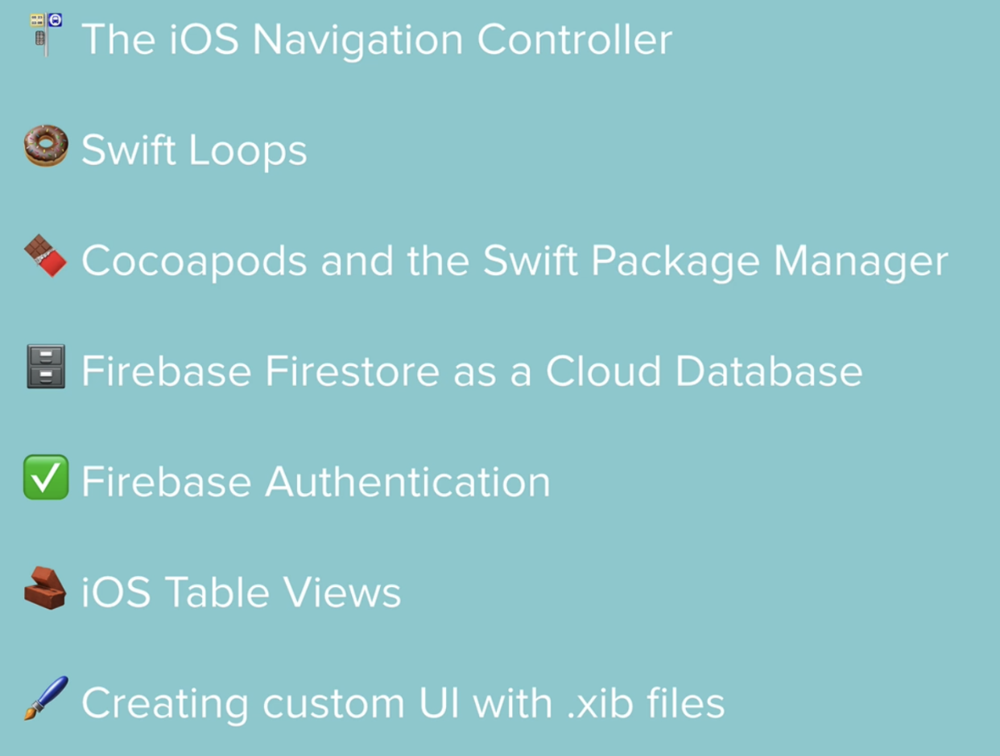

# Flash-Chat-Section-15

## Demo

## Section content can be seen below:

## Key concepts shown in this section are:

174 - Segue(show), navigation stack  
175 - Typing animation, timer, for in loop  
180 - Installs CLTypingLabel pod to project  
182 - Uses CLTypingLabel pod on project  
184 - Adds firebase to project  
185 - Registers new users with FirebaseAuth  
186 - Logging in existing users  
187 - Log out operations, navigationController.popToRootViewController, navigationItem.hidesBackButton, title  
188 - Constants, static (type property)  
189 - UITableView, UITableViewDataSource, indexPath, UITableViewDelegate   
190 - Customising cells in a tableview using a .xib File - Xib file, nib, UINib  
192 - Firestore as a db  
193 - Retrieving data from firestore - QuerySnapshot, tableView.reloadData  
194 - Listening for updates on firestore - addSnapshotListener  
195 - Data sorting and DB rules  
196 - IQKeyboardManagerSwift, Swift Package Manager, enable, enableAutoToolbar, resignOnTouchOutside  
197 - viewWillAppear, viewWillDisappear, navigationController.isNavigationBarHidden, tableView.scrollToRow, DispatchQueue.main.async  
